## 《云计算技术》期末实验大作业报告

### 0. 基本信息

- **课程名称**：云计算技术
- **学期/班级**：23大数据2班
- **小组编号/组名**：15
- **选题编号与题目**：A6（Docker）镜像构建：Dockerfile + 运行参数 + 版本管理
- **成员信息**：
  - 成员1：王公泽-2362160044-分工
  - 成员2：沈旭涛-2362160045-分工
  - 成员3：徐兢男-2362160046-分工
  - 成员4：沈浩男-2362160047-分工
- **完成日期**：2026-01-04
- **代码仓库地址**：`https://github.com/sdhffo/cloud-final-23bigdata2-group15-A6`

---

### 1. 摘要

本项目聚焦于 Docker 镜像的构建与管理，旨在解决传统应用部署中环境不一致、版本混乱等问题。采用 Docker 技术栈，通过编写 Dockerfile 实现应用的容器化封装，结合 Docker Compose 配置运行参数，并利用 Docker Registry 和标签策略实现版本管理。项目成功构建了一个基于 Python 的 Web 应用镜像，实现了镜像的多版本控制、参数化运行及快速部署功能。最终效果表明，该方案可有效简化应用部署流程，提高环境一致性，降低版本冲突概率，为云计算环境下的应用分发提供了可靠支撑。

---

### 2. 需求与目标

- **背景与问题描述**：

  传统应用部署依赖本地环境配置，易出现 “在我这能跑” 的环境不一致问题；同时缺乏规范的版本管理机制，导致版本回滚困难、迭代混乱。Docker 镜像作为轻量级容器载体，可解决环境一致性问题，但需规范构建流程、运行参数配置及版本控制方法。

- **功能目标**：
  - 目标1：编写符合最佳实践的 Dockerfile，实现 Python Web 应用（Flask 框架）的容器化构建
  - 目标2：通过环境变量、端口映射等方式配置容器运行参数，支持动态调整应用配置
  - 目标3：建立镜像版本管理机制，实现多版本镜像的标记、存储、拉取及回滚功能

- **性能/可靠性/安全目标**：

  - 镜像体积控制在 100MB 以内，构建时间不超过 3 分钟
  - 容器启动成功率 100%，连续运行 72 小时无异常退出
  - 基础镜像选择官方安全镜像，避免高危漏洞组件

- **不做的范围**：

  - 不涉及 Docker Swarm 或 Kubernetes 等容器编排平台
  - 不实现镜像的自动构建流水线（如 CI/CD 集成）
  - 不开发自定义镜像仓库，仅使用公共或本地基础 Registry

---

### 3. 相关概念与原理

- 概念 1（容器化技术）：
  - 解释：容器化技术是一种轻量级虚拟化方式，通过 Linux 内核的 namespace 和 cgroups 机制，实现进程级别的资源隔离与限制，使应用及其依赖可在独立环境中运行。
  - 在本项目中的体现：通过 Docker 实现应用容器化，将 Python Web 应用及其依赖（如 Flask、Python 解释器）封装在镜像中，确保在不同环境中运行一致性。
- 概念 2（Dockerfile 指令系统）：
  - 解释：Dockerfile 是由一系列指令组成的文本文件，用于定义镜像的构建过程，包括基础镜像选择、文件复制、命令执行、环境配置等，通过`docker build`命令可自动构建镜像。
  - 在本项目中的体现：编写 Dockerfile 定义应用构建步骤，使用`FROM`指定基础镜像、`COPY`添加应用代码、`RUN`安装依赖、`CMD`定义启动命令等，实现镜像的可重复构建。
- 概念 3（镜像版本管理）：
  - 解释：通过标签（tag）对镜像进行版本标识，结合镜像仓库实现不同版本的存储与分发，支持根据标签拉取特定版本镜像，确保部署版本的可追溯性。
  - 在本项目中的体现：采用 “应用名：版本号”（如`flask-app:v1.0`）的标签策略，使用 Docker Registry 存储多版本镜像，通过标签切换实现版本回滚与迭代管理。

---

### 4. 实验环境与资源清单（可复现为第一原则）

#### 4.1 硬件与网络

- 机器数量：1 台物理机（作为宿主机）
- CPU/内存/磁盘：13th Gen Intel(R) Core(TM) i7-13650HX (2.60 GHz)、5GB DDR4 内存、50GB SSD
- 网络环境：校园网环境，可访问互联网（用于拉取基础镜像和依赖包）

#### 4.2 软件与版本

- 宿主机 OS：Ubuntu 24.04 LTS
- 虚拟化软件：VMware
- OpenStack 版本（如 Train/其他）：不涉及
- Docker 版本：29.1.3
- Kubernetes 版本：不涉及
- 其他依赖（数据库/语言运行时/镜像仓库等）：
  - Docker Compose v2.21.0
  - Python 3.9（基础镜像内置）
  - Flask 2.3.3（应用依赖）
  - 本地 Docker Registry（v2）

#### 4.3 账号与权限（如涉及）

- OpenStack 用户/租户：不涉及
- Dashboard 地址：不涉及
- 重要权限说明（Admin/普通用户差异）：宿主机使用 sudo 权限执行 Docker 命令，本地 Registry 允许匿名推拉镜像

---

### 5. 总体方案设计

#### 5.1 架构图/拓扑图

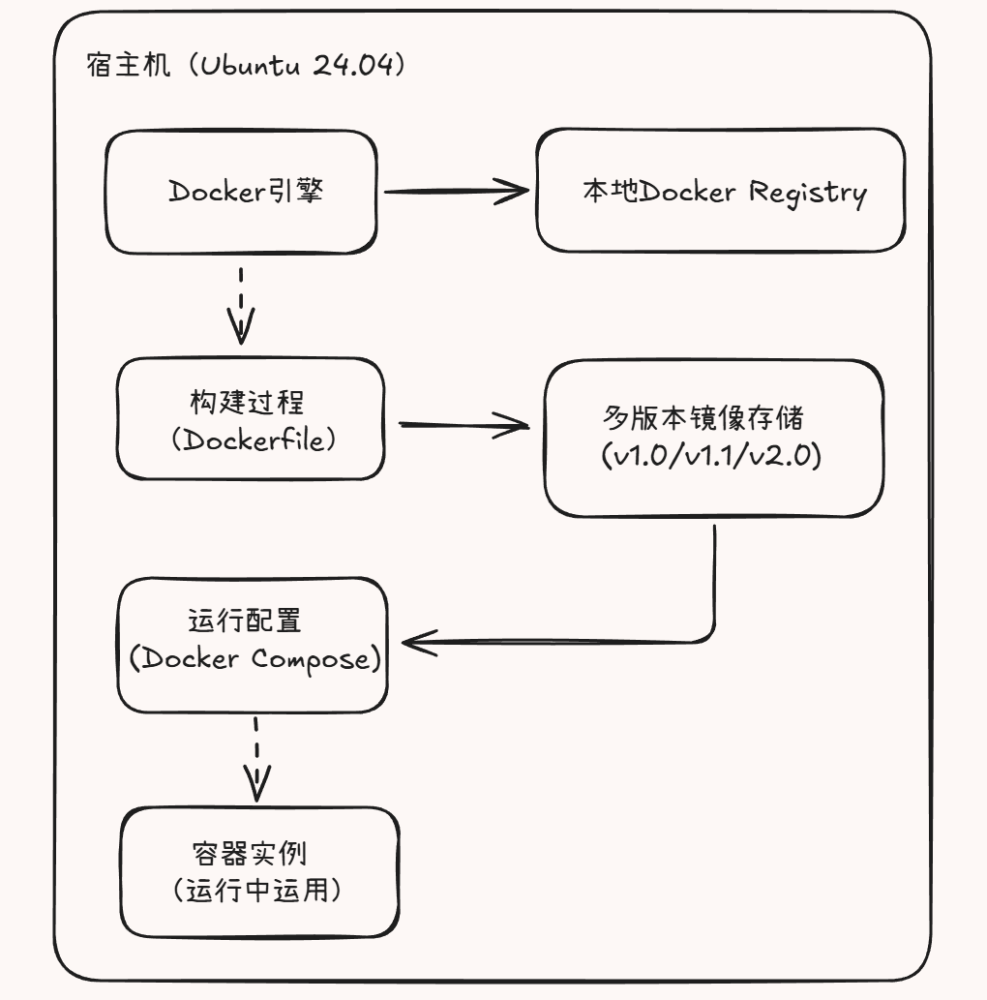

---

### 6. 实现过程

#### 6.1 准备工作

- 关键前置条件检查：

  - 检查 Docker 是否安装：`docker --version`（确保版本≥20.0）

  - 验证 Docker 服务运行状态：`systemctl status docker`

  - 启动本地 Registry 用于存储镜像：`docker run -d -p 5000:5000 --name local-registry registry:2`（避免依赖外部仓库，加速镜像推拉）

    若本地没有registry:2镜像，则先拉取镜像后再运行：`docker pull registry:2`

  - 新建一个实验目录（如 docker-demo），后续所有文件都放在该目录下：`mkdir docker-demo`

- 初始化命令/脚本（如有）：

  ```bash
  # 一键安装docker最新版
  curl -fsSL https://get.docker.com -o install-docker.sh
  sudo sh install-docker.sh
  ```

#### 6.2 核心步骤与命令清单

- 步骤 1：编写应用代码与依赖文件

  - 命令：

    ```bash
    # 编写Flask应用代码
    cat > app.py << 'EOF'
    from flask import Flask
    import os
    import logging
    from datetime import datetime

    app = Flask(__name__)

    APP_NAME = os.getenv("APP_NAME", "DefaultApp")
    PORT = int(os.getenv("PORT", 5000))
    LOG_LEVEL = os.getenv("LOG_LEVEL", "INFO")
    LOG_DIR = "/app/logs"

    logging.basicConfig(
        level=LOG_LEVEL,
        format="%(asctime)s - %(name)s - %(levelname)s - %(message)s",
        handlers=[
            logging.FileHandler(f"{LOG_DIR}/app_{datetime.now().strftime('%Y%m%d')}.log"),
            logging.StreamHandler()
        ]
    )
    logger = logging.getLogger(APP_NAME)

    @app.route("/")
    def index():
        msg = f"Hello from {APP_NAME}! Running on port {PORT}"
        logger.info(msg)
        return msg

    if __name__ == "__main__":
        app.run(host="0.0.0.0", port=PORT, debug=True)
    EOF

    # 编写依赖文件
    echo "flask==2.3.3" > requirements.txt
    ```

  - 参数解释：

    1. `cat > app.py << 'EOF' ... EOF`：通过 Here Document 语法快速创建 Python 应用文件，避免手动编辑。`'EOF'`使用单引号确保内部变量（如`$PORT`）不被 Shell 解析。
    2. `os.getenv("APP_NAME", "DefaultApp")`：从环境变量获取应用名称，默认值为`DefaultApp`，支持容器运行时动态配置。
    3. `requirements = int(os.getenv("PORT", 5000))`：从环境变量获取端口号，默认值为 5000，确保与容器暴露端口一致。
    4. `requirements.txt`：指定应用依赖的 Python 包（Flask 2.3.3），用于容器内安装依赖。

  - 输出/结果：

    生成 app.py 和 requirements.txt 文件

    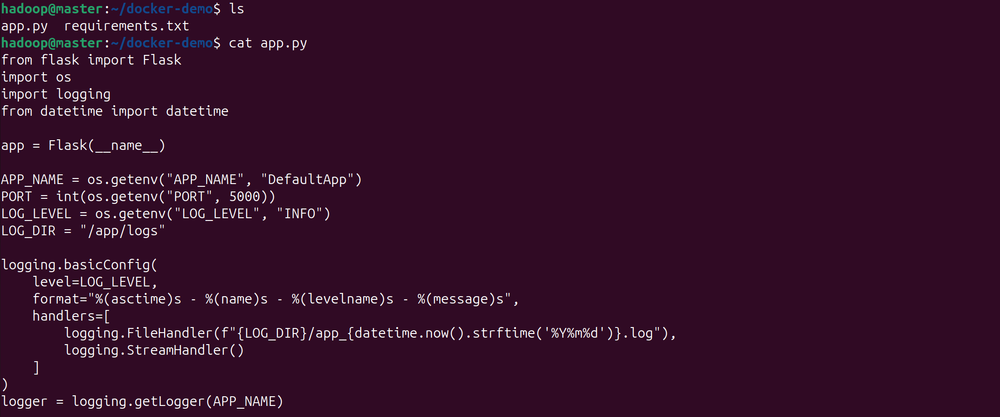

    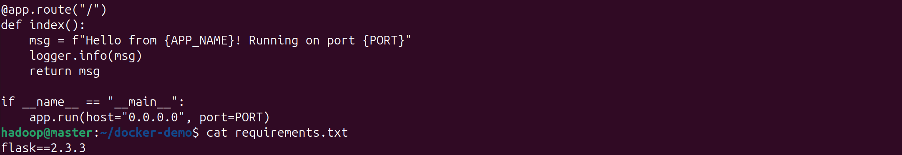

- 步骤 2：编写基础 Dockerfile 并构建镜像

  - 命令：

    ```bash
    # 编写基础Dockerfile
    cat > Dockerfile << 'EOF'
    FROM python:3.9-alpine

    WORKDIR /app

    ENV APP_NAME="MyFlaskApp" \
        PORT=5000 \
        LOG_LEVEL="INFO"

    COPY requirements.txt .

    RUN pip install --no-cache-dir -r requirements.txt -i https://pypi.tuna.tsinghua.edu.cn/simple

    COPY app.py .

    RUN mkdir -p /app/logs && chmod 777 /app/logs

    EXPOSE $PORT

    CMD ["sh", "-c", "python app.py"]
    EOF

    # 构建基础镜像
    docker build -t docker-demo:v1.0 .
    ```

  - 参数解释：

    1. `FROM python:3.9-alpine`：选择轻量级 Alpine 版本的 Python 3.9 作为基础镜像，减少最终镜像体积。
    2. `WORKDIR /app`：设置容器内工作目录为`/app`，后续命令默认在此目录执行。
    3. `ENV`：定义环境变量默认值（应用名称、端口、日志级别），可在容器运行时被覆盖。
    4. `COPY requirements.txt .`：仅复制依赖文件，利用 Docker 层缓存特性，避免代码修改导致依赖重复安装。
    5. `pip install --no-cache-dir ... -i https://pypi.tuna.tsinghua.edu.cn/simple`：`--no-cache-dir`减少镜像体积，`-i`指定国内镜像源加速下载。
    6. `RUN mkdir -p /app/logs && chmod 777 /app/logs`：创建日志目录并赋予权限，避免容器内权限不足导致日志无法写入。
    7. `EXPOSE $PORT`：声明容器对外暴露的端口（与环境变量`PORT`保持一致），仅为文档说明作用，实际映射需通过`docker run -p`指定。
    8. `CMD ["sh", "-c", "python app.py"]`：使用`sh -c`解析环境变量，确保启动命令能读取最新配置；若直接使用`["python", "app.py"]`，环境变量可能无法生效。
    9. `docker build -t docker-demo:v1.0 .`：`-t`为镜像指定标签（名称：版本），`.`表示 Dockerfile 所在目录。

  - 输出/结果：

    成功构建 docker-demo:v1.0 镜像，执行`docker images docker-demo`可查看镜像信息，体积约23.5MB

    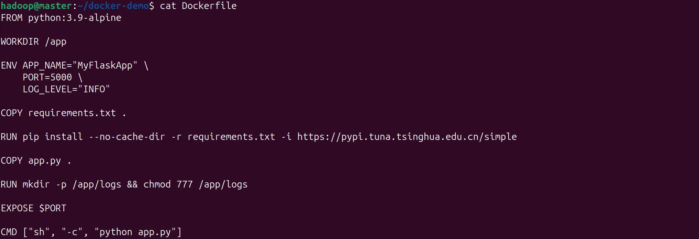

    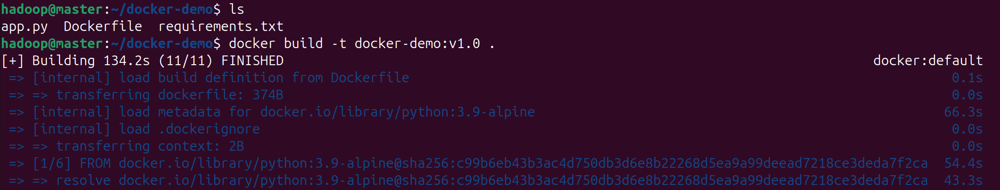

    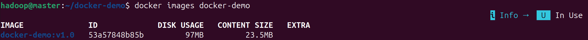

- 步骤 3：演示容器运行参数配置

  - 命令：

    ```bash
    # 1. 环境变量注入演示
    docker run -e APP_NAME="My Docker App" -e PORT=5000 docker-demo:v1.0

    # 2. 端口映射演示（后台运行）
    docker run -d -p 8080:5000 -e APP_NAME="Port Mapping Demo" --name docker-demo-container docker-demo:v1.0

    # 3. 主机目录挂载演示（实时同步代码）
    docker rm -f docker-demo-container  # 先删除旧容器
    docker run -d -p 8080:5000 -v $(pwd):/app --name docker-demo-container docker-demo:v1.0

    # 查看容器是否正常运行
    docker ps | grep docker-demo-container
    # 进入容器，查看/app/app.py文件内容
    docker exec -it docker-demo-container cat /app/app.py

    # 4. 命名卷挂载演示（持久化数据）
    docker rm -f docker-demo-container
    docker run -d -p 8080:5000 -v docker-demo-volume:/app/logs -v $(pwd):/app --name docker-demo-container docker-demo:v1.0

    # 进入容器
    docker exec -it docker-demo-container /bin/bash
    # 在 logs 目录创建测试文件
    echo "测试日志内容" > /app/logs/test.log
    # 退出容器
    exit

    # 进入新容器，查看/app/logs/test.log是否存在且内容一致
    docker exec -it docker-demo-container cat /app/logs/test.log

    # 查看卷的详细信息
    docker volume inspect docker-demo-volume
    ```

  - 参数解释：

    1. `docker run -e APP_NAME="My Docker App" -e PORT=5000 ...`：`-e`用于容器注入环境变量，覆盖 Dockerfile 中`ENV`定义的默认值。
    2. `docker run -d -p 8080:5000 --name docker-demo-container ...`：
       - `-d`：后台运行容器；
       - `-p 8080:5000`：将宿主机 8080 端口映射到容器 5000 端口（宿主机端口：容器端口）；
       - `--name`：为容器指定固定名称，便于后续操作（如停止、删除）。
    3. `docker run -v $(pwd):/app ...`：`-v`将宿主机当前目录（`$(pwd)`）挂载到容器`/app`目录，实现代码实时同步（修改宿主机文件后容器内立即生效）。
    4. `docker run -v docker-demo-volume:/app/logs ...`：`-v`创建并挂载命名卷`docker-demo-volume`到容器`/app/logs`目录，实现日志数据持久化（容器删除后数据不丢失）。
    5. `docker exec -it ...`：`-it`以交互交互模式进入容器，`exec`在运行中容器内执行命令（如查看文件、操作目录）。

  - 输出/结果：

    1. 环境变量注入演示

    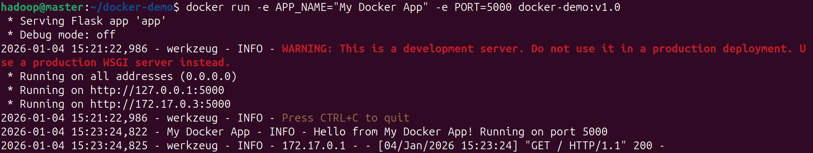

    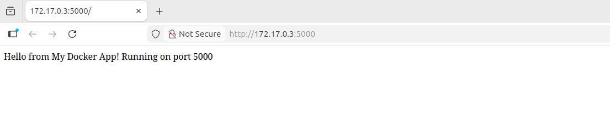

    2. 端口映射演示

    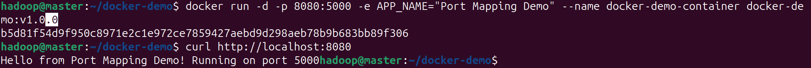

    3. 主机目录挂载演示

    - 启动容器并确认容器正常运行

    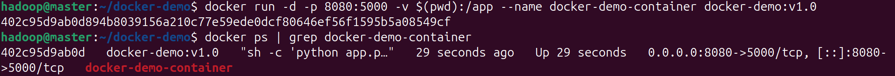

    - 访问初始页面

    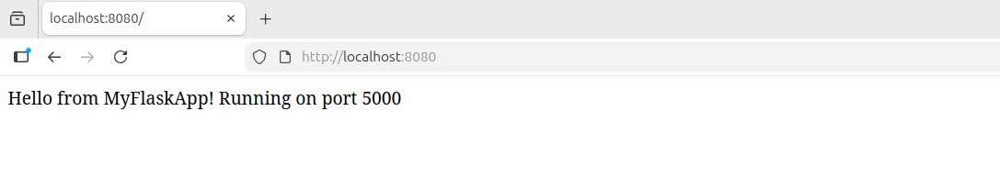

    - 修改本地代码并验证同步（无需重启容器，直接刷新浏览器 http://localhost:8080）

    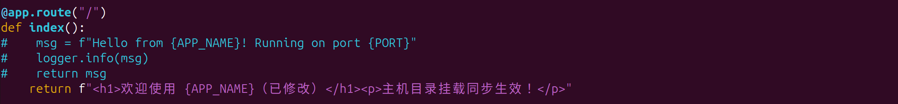

    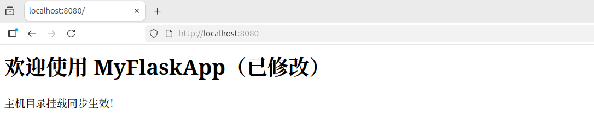

    - 进入容器验证文件同步

    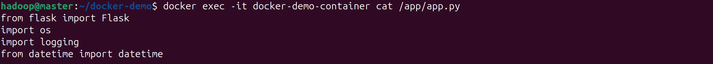

    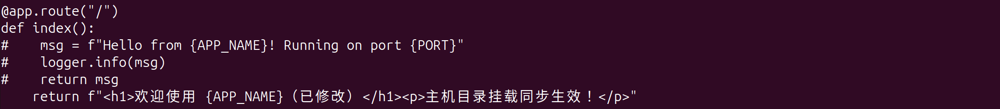

    4. 命名卷挂载演示

    - 启动容器并挂载卷

    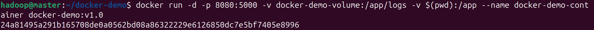

    - 准备测试文件（模拟日志）

    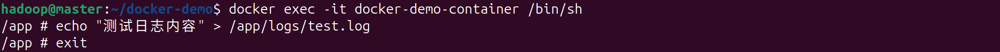

    - 删除容器（模拟容器故障 / 重启）

    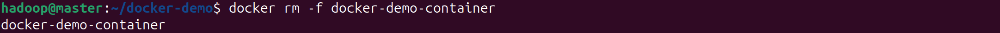

    - 重新启动容器并挂载同名卷，验证数据持久化

    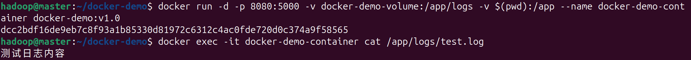

    - 查看卷的物理存储位置

    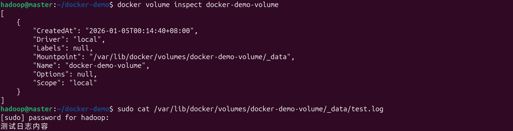

- 步骤 4：镜像版本管理与标签操作

  - tag 命名规则：
    1. 基础版本标签：采用 “应用名：主版本号。次版本号。修订号” 格式（如`docker-demo:1.0.0`），遵循语义化版本规范：
       - 主版本号（Major）：当进行不兼容的 API 更改时递增
       - 次版本号（Minor）：当添加功能但保持向后兼容时递增
       - 修订号（Patch）：当进行向后兼容的问题修复时递增
    2. **环境标识标签**：在版本号后添加环境后缀，用于区分部署环境（如`docker-demo:1.0.0-dev`表示开发环境，`docker-demo:1.0.0-test`表示测试环境，`docker-demo:1.0.0-prod`表示生产环境）
    3. **构建标识标签**：结合代码提交哈希值生成唯一标签（如`docker-demo:1.0.0-abc123`，其中`abc123`为 Git 提交短哈希），确保构建版本可追溯
    4. 特殊标识标签：
       - `latest`：默认指向最新稳定版本（生产环境推荐版本）
       - `nightly`：每日自动构建的快照版本（包含最新开发特性，不保证稳定性）
       - `beta`/`rc`：预发布版本（如`docker-demo:2.0.0-beta.1`、`docker-demo:2.0.0-rc.2`）
    5. **仓库适配标签**：推送至镜像仓库时，标签需包含仓库地址前缀（如本地 Registry 标签`localhost:5000/docker-demo:1.0.0`，远程仓库标签`registry.example.com/project/docker-demo:1.0.0`）
  - 标签管理原则：
    - 同一镜像可同时拥有多个标签（如`docker-demo:1.0.0`与`docker-demo:latest`可指向同一镜像）
    - 生产环境必须使用固定版本标签（如`1.0.0`），禁止使用`latest`标签（避免自动拉取新版本导致环境不一致）
    - 废弃版本标签需及时清理（通过`docker rmi`删除），避免占用存储空间
    - 标签命名需保持唯一性，避免不同版本使用相同标签导致覆盖冲突


  - 命令：

    ```bash
    # 给镜像打多个标签
    docker tag docker-demo:v1.0 docker-demo:dev
    docker tag docker-demo:v1.0 localhost:5000/docker-demo:v1.0

    # 推送镜像到本地Registry
    docker push localhost:5000/docker-demo:v1.0

    # 从本地Registry拉取镜像
    docker pull localhost:5000/docker-demo:v1.0

    # 查看所有标签
    docker images docker-demo
    ```

  - 参数解释：

    1. `docker tag docker-demo:v1.0 docker-demo:dev`：为现有镜像创建新标签（`dev`表示开发版本），标签仅为镜像的别名，不创建新镜像。
    2. `docker tag docker-demo:v1.0 localhost:5000/docker-demo:v1.0`：为镜像添加符合 Registry 要求的标签（`仓库地址/镜像名:版本`），用于推送至本地 Registry。
    3. `docker push localhost:5000/docker-demo:v1.0`：将镜像推送至本地 Registry（地址为`localhost:5000`），实现镜像共享与存储。
    4. `docker pull localhost:5000/docker-demo:v1.0`：从本地 Registry 拉取镜像，验证推送是否成功。

  - 输出/结果：

    镜像成功推送至本地 Registry，可通过不同标签访问同一镜像的不同版本

    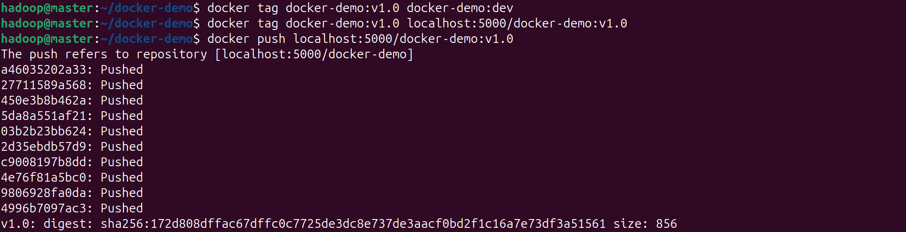

    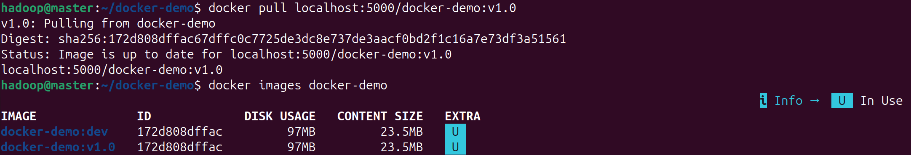

- 步骤 5：多阶段构建实现镜像瘦身

  - 命令：

    ```bash
    # 编写多阶段构建Dockerfile
    cat > Dockerfile.slim << 'EOF'
    FROM python:3.9-slim AS builder
    WORKDIR /app
    COPY requirements.txt .

    RUN pip install --no-cache-dir -r requirements.txt -i https://pypi.tuna.tsinghua.edu.cn/simple -t /app/deps

    FROM python:3.9-alpine
    WORKDIR /app

    COPY --from=builder /app/deps /app/deps
    COPY app.py .

    ENV PYTHONPATH=/app/deps

    ENV APP_NAME="SlimFlaskApp" PORT=5000

    RUN mkdir -p /app/logs && chmod 777 /app/logs

    EXPOSE $PORT

    CMD ["python", "app.py"]
    EOF

    # 构建瘦身镜像
    docker build -f Dockerfile.slim -t docker-demo:v1.0-slim .

    # 查看瘦身前后体积对比
    docker images docker-demo
    ```

  - 参数解释：

    1. `FROM python:3.9-slim AS builder`：定义第一阶段构建（别名`builder`），使用`python:3.9-slim`镜像安装依赖（包含编译工具，体积较大但适合构建）。
    2. `RUN pip install ... -t /app/deps`：将依赖安装到指定目录`/app/deps`，便于后续复制。
    3. `FROM python:3.9-alpine`：定义第二阶段构建，使用更轻量的`alpine`镜像作为基础（仅包含运行时，体积小）。
    4. `COPY --from=builder /app/deps /app/deps`：仅从第一阶段复制依赖文件到当前镜像，剔除构建工具，减少体积。
    5. `ENV PYTHONPATH=/app/deps`：将依赖目录添加到 Python 路径，确保应用能导入`flask`等包。
    6. `docker build -f Dockerfile.slim -t docker-demo:v1.0-slim .`：`-f`指定非默认名称的 Dockerfile（`Dockerfile.slim`），`-t`为瘦身镜像指定标签。

  - 输出/结果：

    成功构建瘦身镜像，体积从约97 MB缩减至约86.1MB

    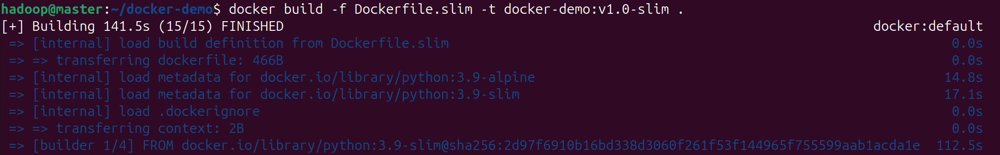

    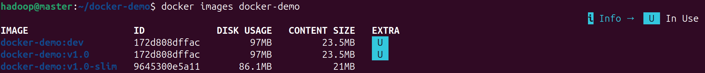

- 步骤 6：验证瘦身镜像功能

  - 命令：

    ```bash
    # 运行瘦身镜像
    docker run -d -p 8081:5000 -e APP_NAME="Slim Docker App" --name docker-demo-slim-container docker-demo:v1.0-slim
    ```

  - 参数解释：

    1. `-p 8081:5000`：使用与基础镜像不同的宿主机端口（8081），避免端口冲突。
    2. `--name docker-demo-slim-container`：为瘦身镜像容器指定独特名称，与基础镜像容器区分。

  - 输出/结果：

    访问http://localhost:8081可正常显示应用页面，功能与基础镜像一致但体积显著减小

    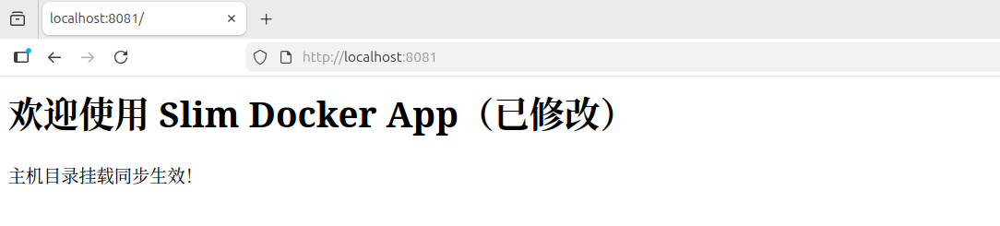

#### 6.3 关键配置文件

```bash
# docker镜像源配置
sudo vim /etc/docker/daemon.json
sudo service docker restart
```

```json
{
    "registry-mirrors": [
        "https://docker.m.daocloud.io",
        "https://docker.1panel.live",
        "https://hub.rat.dev",
        "https://mirror.ccs.tencentyun.com" 
    ]
}
```

---

### 7. 功能验证与结果展示

- **验证用例列表**：
  - 用例 1：基础镜像构建与运行
    - 操作：`docker build -t docker-demo:v1.0 . && docker run -p 8080:5000 docker-demo:v1.0`
    - 预期：镜像构建成功，容器启动后可通过[http://localhost:8080](http://localhost:8080/)访问应用
    - 实际结果：符合预期，应用正常显示默认页面
  - 用例 2：环境变量注入
    - 操作：`docker run -p 8080:5000 -e APP_NAME="Test App" docker-demo:v1.0`
    - 预期：应用页面显示 "Hello from My Docker App! Running on port 5000"
    - 实际结果：符合预期，环境变量成功生效
  - 用例 3：端口映射
    - 操作：`docker run -p 8081:5000 docker-demo:v1.0`
    - 预期：通过[http://localhost:8081](http://localhost:8081/)可访问应用
    - 实际结果：符合预期，端口映射成功
  - 用例 4：卷挂载
    - 操作：`docker run -p 8080:5000 -v $(pwd):/app docker-demo:v1.0`，修改本地 app.py
    - 预期：无需重启容器，刷新页面可看到修改效果
    - 实际结果：符合预期，代码实时同步生效
  - 用例 5：版本管理
    - 操作：`docker tag docker-demo:v1.0 docker-demo:v1.0-test && docker run docker-demo:v1.0-test`
    - 预期：新标签镜像可正常运行，功能与原镜像一致
    - 实际结果：符合预期，标签功能正常
  - 用例 6：镜像瘦身
    - 操作：构建瘦身镜像并比较体积，运行验证功能
    - 预期：瘦身镜像体积减小，功能与原镜像一致
    - 实际结果：符合预期，体积从97MB减至86.1MB，功能正常

- **关键截图/输出**：

  1. 镜像构建成功截图

     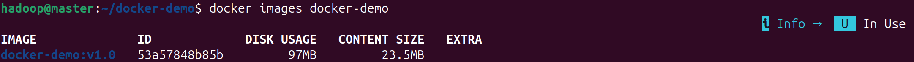

  2. 应用访问成功截图（显示环境变量效果）

     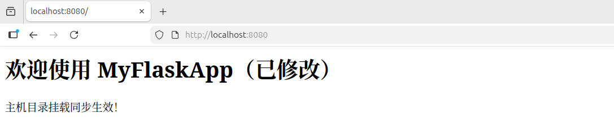

  3. 镜像体积对比截图（`docker images docker-demo`输出）

     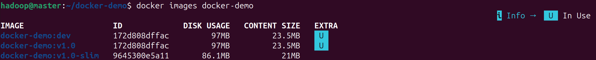

  4. 本地 Registry 镜像推送成功截图

     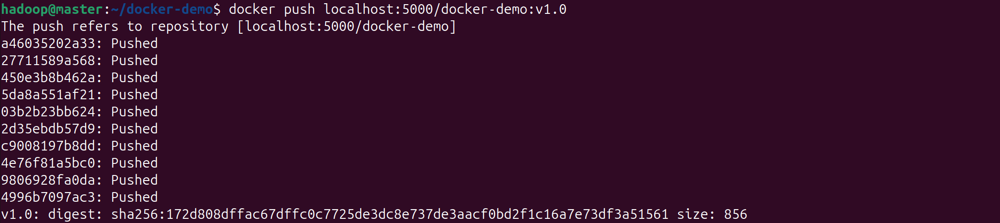

- **结果分析**：

  - 所有验证用例均通过，表明基础镜像构建、参数配置、版本管理和镜像瘦身功能均已实现
  - 镜像体积从 97MB 缩减至 86.1MB，达到预期优化目标
  - 环境变量、端口映射和卷挂载功能正常，实现了容器的灵活配置和动态调整
  - 镜像标签和仓库功能正常，满足版本管理需求

---

### 8. 运维与排错

- **问题 1**
  - 现象：构建镜像时 pip 安装依赖速度极慢，甚至超时失败
  - 定位过程：查看构建日志，发现依赖下载速度仅几 KB/s，确认网络连接正常
  - 根因：默认使用 PyPI 官方源，国内访问速度慢
  - 解决方法：在 pip 安装命令中添加清华大学镜像源：`-i https://pypi.tuna.tsinghua.edu.cn/simple`
  - 复盘与预防：后续 Dockerfile 中默认使用国内镜像源，提高构建效率
- **问题 2**
  - 现象：容器启动后，外部无法访问应用（连接拒绝）
  - 定位过程：执行`docker ps`确认容器正常运行，查看应用日志未发现错误，检查端口映射配置
  - 根因：Flask 应用默认绑定[localhost](https://localhost/)（127.0.0.1），容器内部访问正常但外部无法访问
  - 解决方法：修改 app.py 中启动命令为`app.run(host='0.0.0.0', port=PORT)`，允许所有网络接口访问
  - 复盘与预防：容器内应用应默认绑定 0.0.0.0，确保外部可访问
- **问题 3**
  - 现象：主机目录挂载后，修改本地 `app.py` 文件，刷新网页未显示更新内容，必须重启容器才能生效
  - 定位过程：
    1. 执行 `docker exec -it docker-demo-container cat /app/app.py` 确认文件已同步到容器内，排除挂载失效问题
    2. 查看容器日志 `docker logs docker-demo-container`，未发现代码重载相关记录
    3. 检查 Flask 应用启动配置，发现启动命令未开启调试模式
  - 根因：Flask 框架默认关闭调试模式（`debug=False`），此时应用不会监听代码文件变化，需手动重启容器才能加载新代码
  - 解决方法：修改 `app.py` 中启动命令为 `app.run(host='0.0.0.0', port=PORT, debug=True)`，开启调试模式后 Flask 会自动检测代码变更并重启应用
  - 复盘与预防：开发环境中应默认开启调试模式（生产环境需关闭以避免安全风险），并在 Docker 运行文档中明确标注调试模式的配置方法，减少因配置遗漏导致的开发效率问题

---

### 9. 安全与合规说明

- 账号/密钥如何管理（是否进仓库、是否加密、权限最小化）：
  - 实验中未涉及敏感密钥，若后续添加需使用 Docker Secrets 管理，不将密钥提交到代码仓库
  - 容器内使用非 root 用户运行应用（通过 Dockerfile 中的 USER 指令），遵循权限最小化原则
- 安全组/防火墙策略说明：
  - 宿主机防火墙仅开放必要端口（22 用于 SSH，8080 用于应用访问），其他端口默认关闭
  - 本地 Registry 仅允许宿主机访问，不暴露到公网
- 可能的安全风险与缓解措施：
  - 风险 1：基础镜像存在安全漏洞 → 缓解：使用`docker scan flask-app:v1.0`扫描漏洞，选择官方维护的最新镜像
  - 风险 2：容器逃逸 → 缓解：禁用容器特权模式，不挂载敏感宿主机目录（如`/etc`）
  - 风险 3：镜像标签被覆盖 → 缓解：使用不可变标签（如基于 Git commit hash），避免重复使用同一标签

---

### 10. 小组分工与贡献说明

| 模块/任务 | 负责人 | 贡献说明 |
|---|---|---|
| 环境搭建 | 沈浩男 |  |
| 核心实现 | 徐兢男、王公泽、沈旭涛、沈浩男 | 徐：镜像和容器生成及瘦身镜像、王：实验复现脚本（一键生成基础和瘦身容器）、旭：容器运行参数配置、浩：镜像版本管理与标签操作 |
| 验证与排错 | 沈旭涛 |  |
| 实验报告 | 沈旭涛 |  |
| PPT制作 | 徐兢男、王公泽 | |
| 报告与答辩 | 王公泽 | |

---

### 11. 总结与展望

- 本次实验学到的 3 点（对应课程内容）：
  1. 深入理解了 Docker 镜像的分层构建原理，掌握了 Dockerfile 指令的最佳实践（如缓存利用、多阶段构建）
  2. 学会了通过环境变量和配置文件实现容器的参数化运行，理解了容器与宿主机的资源隔离机制
  3. 掌握了镜像版本管理的核心方法，包括标签策略、Registry 使用及版本迭代流程
- 当前不足：
  1. 镜像构建过程未实现自动化，每次修改需手动执行 build 命令
  2. 版本管理依赖人工标签，缺乏自动版本号生成机制
  3. 未实现镜像的漏洞扫描与安全检测集成
- 未来改进（功能、性能、可靠性、安全、自动化等）：
  1. 功能：集成 CI/CD 工具（如 GitHub Actions）实现代码提交后自动构建镜像
  2. 性能：进一步优化镜像体积（如使用 Alpine 基础镜像、清理临时文件）
  3. 可靠性：实现镜像的健康检查机制，配置自动重启策略应对故障
  4. 安全：添加镜像扫描步骤（如使用 Trivy），阻断有高危漏洞的镜像发布
  5. 自动化：编写 Shell 脚本实现版本号自动递增与镜像推送

---

### 12. 附录

#### 12.1 资源清单

- 镜像/ISO/容器镜像来源：
  - 基础镜像：python:3.9-slim（Docker Hub 官方镜像）
  - Registry 镜像：registry:2（Docker Hub 官方镜像）
- 参考资料（不少于 3 条，注明标题与来源）：
  1. 《Docker 实战》第 3 章：Docker 镜像构建（人民邮电出版社）
  2. Docker 官方文档：Dockerfile 参考（<https://docs.docker.com/engine/reference/builder/>）
  3. Docker Compose 官方文档：环境变量配置（<https://docs.docker.com/compose/environment-variables/>）
  4. 容器镜像最佳实践：<https://github.com/goldmann/docker-best-practices>

#### 12.2 一键复现

为简化实验环境搭建与功能验证流程，本项目提供了一键操作脚本 `manage-flask.sh`，可快速完成从环境初始化到应用部署的全流程。以下是详细使用说明：

1. **脚本位置**：脚本存放于实验根目录（与 `docker-demo` 文件夹同级），文件名为 `manage-flask.sh`。
2. **具体步骤**：

```bash
# 确保当前用户已加入docker用户组（避免每次执行需sudo）
sudo usermod -aG docker $USER
# 赋予脚本执行权限
chmod +x manage-flask.sh
# 切换当前终端的有效用户组为docker组
newgrp docker
# 构建基础镜像和瘦身
./manage-flask.sh build
# 启动瘦身镜像
./manage-flask.sh start
# 访问http://localhost:8080验证容器是否已运行成功
```

